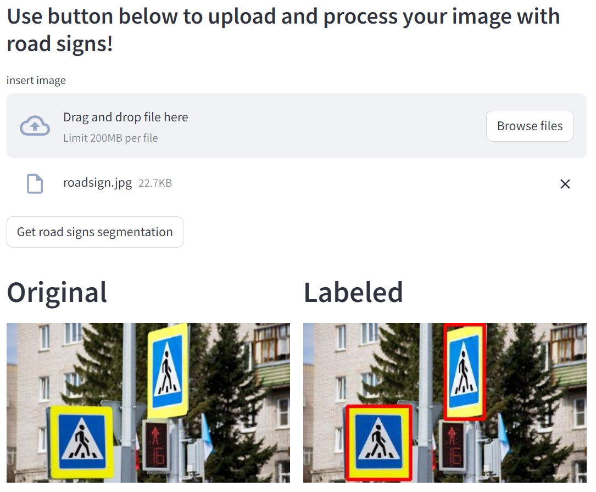
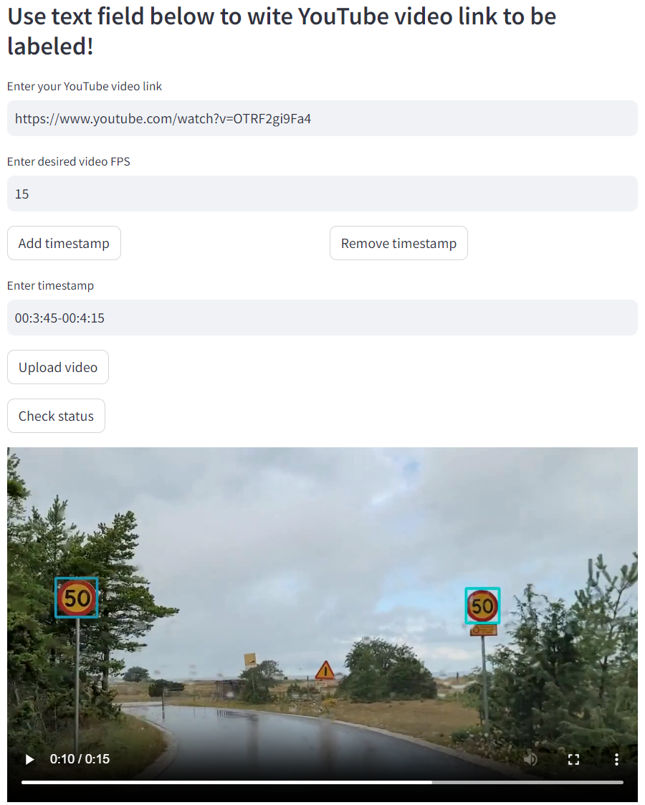

<div id="top"></div>

<!-- PROJECT LOGO -->
<br />
<div align="center">

<h3 align="center">ITMO Practical Deep Learning Course</h3>

  <p align="center">
    Resume - vacancies matching service
    <!-- <br />
    <a href="">View Demo</a>
    ·
    <a href="">Report Bug</a>
    ·
    <a href="">Request Feature</a> -->
  </p>
</div>

<!-- TABLE OF CONTENTS -->
<details>
  <summary>Table of Contents</summary>
  <ol>
    <li>
      <a href="#updates">Updates</a>
    </li>
     <li>
      <a href="#preprocessing">preprocessing</a>
    </li>
    <li>
      <a href="#about-the-project">About The Project</a>
      <ul>
        <li><a href="#built-with">Built With</a></li>
      </ul>
    </li>
    <li>
      <a href="#getting-started">Getting Started</a>
      <ul>
        <li><a href="#prerequisites">Prerequisites</a></li>
        <li><a href="#installation">Installation</a></li>
      </ul>
    </li>
    <li><a href="#works-cited">Works Cited</a></li>
    <li><a href="#acknowledgments">Acknowledgments</a></li>
  </ol>
</details>

<!-- UPDATES -->
## Updates 

### 17.12.2023:
The final projects consists of ...

### 15.12.2023:
We trained 

### 16.11.2023:
Currently we trained only one model and implemented one endpoint (image processing), so our roadmap is:
 

For more info please visit <a href="https://puffy-power-aa4.notion.site/Team-19-Traffic-Signs-Recognition-ee2c3f596a6044a69077984fbe6354d8">our notion page</a>.
<!-- preprocessing -->
## Preprocessing
We had to work on our data as there weren't any 'ready' datasets for our project. <a href="https://www.kaggle.com/datasets/vyacheslavpanteleev1/hhru-it-vacancies-from-20211025-to-20211202">Dataset with vacancies</a> was matched with <a href="https://drive.google.com/file/d/1ikA_Ht45fXD2w5dWZ9sGTSRl-UNeCVub/view?usp=share_link">resume data</a> manually, with 2 different approaches:
* By calculating similarities between full texts of resumes and vacancies using Word2Vec, Doc2Vec and TFidVectorization (file resume_matching_data.ipynb). But the results we got here were dissatisfying.
* By matching on key words and setting strict filters on data. This approach turned out to be effective.

<!-- ABOUT THE PROJECT -->
## About The Project

In this project we provide both highly efficient and accurate service for matching CVs with available vacancies using <a href="https://huggingface.co/sentence-transformers/distiluse-base-multilingual-cased-v1">Distiluse sentence-transformer</a>. We are using FastAPI and Celery for backend task creation and processing, and Streamlit for cool and minimalistic frontend. RabbitMQ is being used for Celery broker and Redis is for result backend.




<p align="right">(<a href="#top">back to top</a>)</p>

### Built With

* [YOLOv8](https://ultralytics.com/yolov8)
* [Streamlit](https://streamlit.io/)
* [FastAPI](https://fastapi.tiangolo.com/)
* [Celery](https://docs.celeryq.dev/en/stable/)
* [RabbitMQ](https://www.rabbitmq.com/)
* [Redis](https://redis.io/)

<p align="right">(<a href="#top">back to top</a>)</p>

<!-- GETTING STARTED -->

### Installation

1. Clone the repo
   ```
   git clone -b trafficsign_detector_main https://github.com/pavviaz/itmo_pdl.git
   ```
2. Place YOLO checkpoint file into `neural_worker/yolo_weights` directory (<a href="https://disk.yandex.ru/d/7HrluCKflrv_0w">our weights</a>, `best_yolo.pt` is for YOLO model, `best_cls.pth` is for classification model)
3. Create `.env` file in root directory with following keys
    ```
    RABBITMQ_IP=amqp://<RABMQ_EXAMPLE_USR>:<RABMQ_EXAMPLE_PASSWD>@rabbitmq:5672/
    REDIS_IP=redis://redis:6379/0

    RABBITMQ_ERLANG_COOKIE=<RABMQ_EXAMPLE_COOKIE>
    RABBITMQ_LOGIN=<RABMQ_EXAMPLE_USR>
    RABBITMQ_PASSWD=<RABMQ_EXAMPLE_PASSWD>

    YOLO_CHECKPOINT=<YOLO_CHECKPOINT_FILE_NAME>
    CLS_CHECKPOINT=<CLS_MODEL_CHECKPOINT_FILE_NAME>
    ``` 
4. Build & run containers
   ```
   sudo docker-compose build
   sudo docker-compose up
   ```
Congratulations! Streamlit is now available at `http://localhost:8501/` and API endpoints are `http://localhost:8000/images` and `http://localhost:8000/video` for image and youtube video processing respectively

<p align="right">(<a href="#top">back to top</a>)</p>

<!-- Works Cited -->
## Works Cited

1. Ultralytics YOLOv8
   
   ```sh
   authors:
    - family-names: Jocher
      given-names: Glenn
      orcid: "https://orcid.org/0000-0001-5950-6979"
    - family-names: Chaurasia
      given-names: Ayush
      orcid: "https://orcid.org/0000-0002-7603-6750"
    - family-names: Qiu
      given-names: Jing
      orcid: "https://orcid.org/0000-0003-3783-7069"
   title: "YOLO by Ultralytics"
   version: 8.0.0
   date-released: 2023-1-10
   license: AGPL-3.0
   url: "https://github.com/ultralytics/ultralytics"
   ```

<!-- CONTACT -->
## Authors

Fyodorova Inessa

Vyaznikov Pavel

<p align="right">(<a href="#top">back to top</a>)</p>
