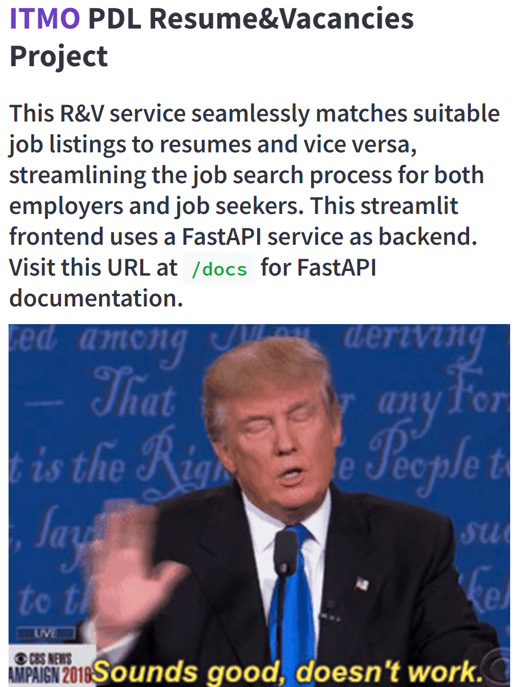

<div id="top"></div>

<!-- PROJECT LOGO -->
<br />
<div align="center">

<h3 align="center">ITMO Practical Deep Learning Course</h3>

  <p align="center">
    Resume&Vacancies Matching Service
  </p>
</div>

<!-- TABLE OF CONTENTS -->
<details>
  <summary>Table of Contents</summary>
  <ol>
    <li>
      <a href="#updates">Updates</a>
    </li>
     <li>
      <a href="#preprocessing">preprocessing</a>
    </li>
    <li>
      <a href="#about-the-project">About The Project</a>
      <ul>
        <li><a href="#built-with">Built With</a></li>
      </ul>
    </li>
    <li>
      <a href="#getting-started">Getting Started</a>
      <ul>
        <li><a href="#prerequisites">Prerequisites</a></li>
        <li><a href="#installation">Installation</a></li>
      </ul>
    </li>
    <li><a href="#works-cited">Works Cited</a></li>
    <li><a href="#acknowledgments">Acknowledgments</a></li>
  </ol>
</details>

<!-- UPDATES -->
## Updates 

### 17.12.2023:
The final project consists of Streamlit UI, FastAPI backend with PostgreSQL and Faiss indexes, and <a href="https://huggingface.co/sentence-transformers/distiluse-base-multilingual-cased-v1">DistilUsev1</a> (trained with ContrastiveCE) on separate embedder module. The embedder module **riches 25 RPS in peak** on 13th Gen Intel(R) Core(TM) i9-13900HX CPU.

### 15.12.2023:
We tried four raw (not trained) popular sentence transformers:
* DistilUsev1
* DistilUsev2
* mpnet
* MiniLM
Concluded that DistilUsev1, even though it was not trained on our data, had the same quality as Doc2Vec. DistilUsev1 was chosen as a base model.

Also service API is now available for searching corresponding vacancies and resumes, using Faiss for storing essintal embeddings and PostgreSQL for other info.

### 13.12.2023:
Experiments with Doc2Vec were made: 
Doc2Vec - v1 (vector_size = 35, epochs = 50): positive similarity = 0.414, positive similarity = 0.298, difference = 0.116. Meteor score: 0.342, 
Rouge score: 0.28.

Doc2Vec - v2 (vector_size = 15, epochs = 50): positive similarity = 0.158, positive similarity = 0.106, difference = 0.0515. Meteor score: 0.126, 
Rouge score: 0.103.

For more info please visit <a href="https://www.notion.so/Team-19-Job-Resume-matching-56f93b10243a4989acbfdcb88d014b03">our notion page</a>.
<!-- preprocessing -->
## Preprocessing
We had to work on our data as there weren't any 'ready' datasets for our project. <a href="https://www.kaggle.com/datasets/vyacheslavpanteleev1/hhru-it-vacancies-from-20211025-to-20211202">Dataset with vacancies</a> was matched with <a href="https://drive.google.com/file/d/1ikA_Ht45fXD2w5dWZ9sGTSRl-UNeCVub/view?usp=share_link">resume data</a> manually, with 2 different approaches:
* By calculating similarities between full texts of resumes and vacancies using Word2Vec, Doc2Vec and TFidVectorization (file resume_matching_data.ipynb). But the results we got here were dissatisfying.
* By matching on key words and setting strict filters on data. This approach turned out to be effective.

<!-- ABOUT THE PROJECT -->
## About The Project

In this project we provide both highly efficient and accurate service for matching CVs with available vacancies using <a href="https://huggingface.co/sentence-transformers/distiluse-base-multilingual-cased-v1">Distiluse sentence-transformer</a>. We use FastAPI with PostgreSQL and Faiss for storing, adding and searching similar resumes and vacancies, Sentence_Transformers for training and inferencing models and Streamlit for cool and minimalistic frontend.




<p align="right">(<a href="#top">back to top</a>)</p>

### Built With

* [DistilUsev1](https://huggingface.co/sentence-transformers/distiluse-base-multilingual-cased-v1)
* [Streamlit](https://streamlit.io/)
* [FastAPI](https://fastapi.tiangolo.com/)
* [PostgreSQL](https://www.postgresql.org/)
* [Faiss](https://github.com/facebookresearch/faiss)

<p align="right">(<a href="#top">back to top</a>)</p>

<!-- GETTING STARTED -->

### Installation

1. Clone the repo
   ```
   git clone -b randv_main https://github.com/pavviaz/itmo_pdl.git
   ```
2. Place SentenceTransformer checkpoint folder into `embedder/weights` directory, and example resume and vacancies CSVs into `api/init_data` (<a href="https://disk.yandex.ru/d/lujblP9pdXRiIw">our weights and data</a>, `ce_model.zip` is model folder, `resume_train_no_index.csv` and `vac_train_no_index.csv` are for resume and vacancies data respectively). Change path for model and data in config files if needed
3. Create `.env` file in root directory with following keys
    ```
    DB_NAME=<EXAMPLE_DB_NAME>
    DB_USER=<EXAMPLE_DB_USER>
    DB_PASSWORD=<EXAMPLE_DB_PASSWD>
    DB_HOST=<EXAMPLE_DB_HOST>
    DB_PORT=5044

    EMBEDDER_URL=http://embedder:5043
    ``` 
4. Build & run containers
   ```
   sudo docker-compose build
   sudo docker-compose up
   ```
Congratulations! Streamlit is now available at `http://localhost:8501/` and API endpoints are at `http://localhost:5041/docs`.

<p align="right">(<a href="#top">back to top</a>)</p>

<!-- Works Cited -->
## Works Cited

1. Sentence-BERT: Sentence Embeddings using Siamese BERT-Networks
   
   ```sh
   @inproceedings{reimers-2019-sentence-bert,
    title = "Sentence-BERT: Sentence Embeddings using Siamese BERT-Networks",
    author = "Reimers, Nils and Gurevych, Iryna",
    booktitle = "Proceedings of the 2019 Conference on Empirical Methods in Natural Language Processing",
    month = "11",
    year = "2019",
    publisher = "Association for Computational Linguistics",
    url = "https://arxiv.org/abs/1908.10084",
    }
   ```

<!-- CONTACT -->
## Authors

Fyodorova Inessa

Kudryashov Georgy

Vyaznikov Pavel

<p align="right">(<a href="#top">back to top</a>)</p>